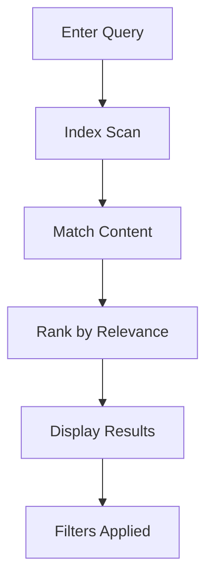

## Overview

yashwanth-test2 provides powerful tools to organize, edit, search, and share your documentation efficiently. You create structured spaces for projects, format content with ease, find information quickly, and export or collaborate seamlessly. These features help teams maintain up-to-date docs without complexity.

<Columns cols={2}>
  <Card title="Structuring" icon="folder" href="#document-structuring">
    Organize docs into folders and hierarchies.
  </Card>
  <Card title="Editing Tools" icon="edit-3" href="#editing-tools">
    Rich formatting with real-time previews.
  </Card>
  <Card title="Search" icon="search" href="#search-functionality">
    Instant results across your space.
  </Card>
  <Card title="Export & Share" icon="share-2" href="#export-sharing">
    Multiple formats and collaboration links.
  </Card>
</Columns>

## Document Structuring and Folders

You build intuitive folder structures to keep documentation organized. Create nested folders for guides, APIs, and FAQs. Drag and drop files to rearrange, and use metadata tags for quick filtering.

<Steps>
  <Step title="Create Folder" icon="folder-plus">
    Navigate to your space root. Click the new folder button and name it `api-reference`.
  </Step>
  <Step title="Add Documents" icon="file-plus">
    Upload MDX files or create new ones inside folders.
  </Step>
  <Step title="Nest Structures" icon="layers">
    Drag subfolders like `endpoints` under `api-reference` for deeper organization.
  </Step>
</Steps>

<Callout kind="tip">
  Use folder prefixes like `[WIP]` for work-in-progress sections to sort dynamically.
</Callout>

## Editing and Formatting Tools

Edit documents with a full-featured Markdown editor supporting MDX components. Preview changes live, and insert tables, images, or code blocks effortlessly.

<Tabs>
  <Tab title="Basic Formatting" icon="type">
    Use standard Markdown:
    
    ````markdown
    # Heading
    
    **Bold** and _italic_ text.
    
    - List item
    - Another item
    ````
  </Tab>
  <Tab title="Advanced MDX" icon="code">
    Embed components:
    
    ````jsx
    <Callout kind="info">
      This is a callout.
    </Callout>
    
    ```javascript
    console.log('Hello, yashwanth-test2!');
    ```
    ````
  </Tab>
</Tabs>

## Search Functionality within Spaces

Search delivers instant, relevance-ranked results across your entire space. Filter by folder, tag, or content type, and use advanced operators like `from:folder-name`.



<Callout kind="info">
  Pro tip: Quote phrases like `"API endpoints"` for exact matches.
</Callout>

## Export and Sharing Options

Export docs to PDF, HTML, or ZIP archives. Generate shareable links with view-only or edit permissions. Embed previews on external sites.

<CodeGroup tabs="PDF,HTML,ZIP">
  ````bash
  # Export command via CLI
  yashwanth-test2 export --space=my-docs --format=pdf output.pdf
  ````
  ````bash
  yashwanth-test2 export --space=my-docs --format=html dist/
  ````
  ````bash
  yashwanth-test2 export --space=my-docs --format=zip archive.zip
  ````
</CodeGroup>

<Expandable title="Advanced Sharing" default-open="false">
  Set permissions:
  
  | Role       | Read | Write | Share |
  |------------|------|-------|-------|
  | Viewer     | Yes  | No    | No    |
  | Editor     | Yes  | Yes   | Yes   |
  | Admin      | Yes  | Yes   | Yes   |
  
  Use `?token=your-share-token` for public links.
</Expandable>

<Columns cols={2}>
  <Card title="Next: Quickstart" icon="zap" href="/quickstart">
    Set up your first space.
  </Card>
  <Card title="API Reference" icon="api" href="/authentication">
    Integrate programmatically.
  </Card>
</Columns>